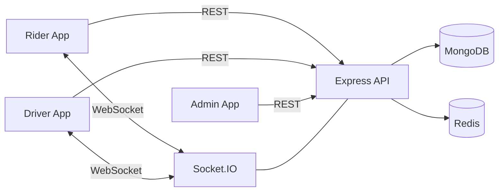
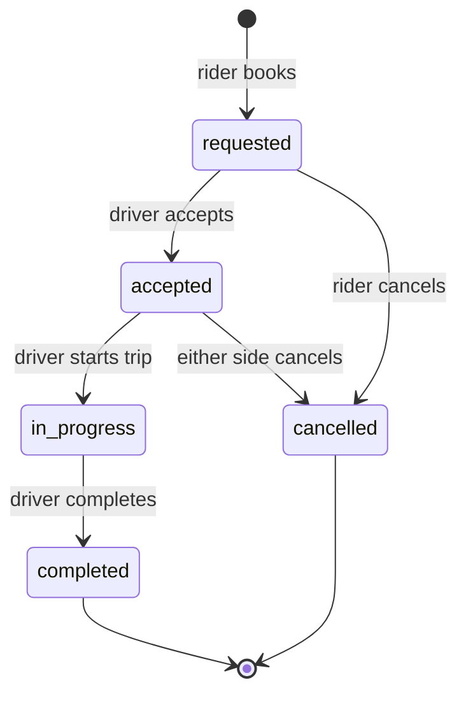

# Safar — Ride-Hailing Platform

A full-stack ride-hailing system built as a monorepo: three separate React applications (rider, driver, admin) running against a single Express + MongoDB API, with live location tracking over WebSockets and Redis handling caching and rate limiting.


---

## Live Demo

| App | URL | What it's for |
|---|---|---|
| **Safar** (Rider) | https://ride-hailing-rider-app-liard.vercel.app | Book a ride, watch the driver approach, pay, review history |
| **Safar Partner** (Driver) | https://ride-hailing-driver-app-rho.vercel.app | Go online, accept requests, run the trip, track earnings |
| **Safar Admin** | https://ride-hailing-admin-app.vercel.app | Approve drivers, monitor live rides, resolve disputes |
| **API** | https://ride-hailing-backend-coan.onrender.com/api/health | Health check endpoint |

> **First request is slow.** The API runs on Render's free tier, which spins the instance down after inactivity. The first call after an idle period takes roughly 50 seconds to wake it. Open the health check URL above first and wait for it to respond, then use the apps.

### Demo accounts

Sign in with these rather than registering — the driver account is already approved, so you can skip the admin approval step.

| App | Email | Password |
|---|---|---|
| **Safar** (Rider) | `testuser@example.com` | `testuser` |
| **Safar Partner** (Driver) | `testdriver@example.com` | `testdriver` |

No shared admin account is published — an admin can suspend drivers and resolve disputes, so it isn't something to hand out openly. To see the admin app, run the project locally and set `isAdmin: true` on your own user (see [Running locally](#running-locally)).

### Walking through a full ride

A ride only progresses when both sides act, so you need two browser windows:

1. Open the **rider** app in a normal window and log in as `testuser@example.com`.
2. Open the **driver** app in an **incognito window** and log in as `testdriver@example.com`. Incognito matters — both apps store their JWT in `localStorage` on the same domain family, so two logins in one browser will overwrite each other.
3. In the driver window, toggle **Go Online**.
4. In the rider window, set pickup and drop-off on the map, choose a vehicle tier, and confirm. The fare is calculated server-side from the distance.
5. The request appears in the driver window. Accept it, and watch the rider's screen switch to live tracking.
6. Drive the flow through: **Start Trip → Complete Trip**. Both screens update over the WebSocket as the status changes.

Then look at **Ride History** in either app, or **Earnings** in the driver app, to see the completed trip.

> These are shared demo accounts, so their ride history reflects whatever other people have been trying. If something looks odd, register a fresh rider — that path works too, it just means an unapproved driver until an admin steps in.

---

## Screenshots

<!-- Add screenshots here. Suggested: rider booking screen with map, driver incoming-request panel, admin live map. -->
<!-- Upload images to a /docs/screenshots folder and reference them like: -->
<!--  -->

_Coming soon._

---

## What it does

**Riders** register, set pickup and drop-off on a Leaflet map, pick a vehicle tier, and watch the assigned driver's position update live until the trip completes. They can save named addresses, browse past rides, and raise a dispute against a completed ride.

**Drivers** register, submit vehicle details, and wait for admin approval before going online. Once online, incoming requests arrive over a WebSocket. They accept, drive to pickup, start the trip, and complete it. Earnings are aggregated across completed rides.

**Admins** approve, reject and suspend drivers, watch every online driver on a live map, browse users and rides with filtering, and resolve disputes raised by either side.

---

## Architecture

```
ride-hail-monorepo/            npm workspaces
│
├── apps/
│   ├── backend-api/           Express 5 + MongoDB + Redis + Socket.IO
│   ├── rider-app/             React 19 SPA  → Safar
│   ├── driver-app/            React 19 SPA  → Safar Partner
│   └── admin-app/             React 19 SPA  → Safar Admin
│
└── packages/
    ├── omnitrack-core/        Shared API + socket contracts, schema shapes
    ├── ui/                    Shared React components
    └── utils/                 Shared helpers
```

Three clients talking to one API creates a drift problem: rename a socket event on the server and three frontends break silently. `packages/omnitrack-core` exists to solve that — event names live there as constants (`SOCKET_EVENTS`), alongside payload shapes documenting what each side sends and receives. Both server and clients import from it rather than hardcoding strings.



---

## Tech stack

| Layer | Choices |
|---|---|
| Frontend | React 19, React Router 7, Context API, Tailwind CSS 4, Vite 8, Leaflet / React-Leaflet, Axios |
| Backend | Node.js, Express 5, Socket.IO 4 |
| Database | MongoDB with Mongoose |
| Cache & limiting | Redis, `rate-limit-redis`, `express-rate-limit` |
| Auth | JWT (`jsonwebtoken`), bcryptjs |
| Security | Helmet, CORS allowlist, express-validator |
| Deployment | Vercel (frontends), Render (API) |

---

## Engineering notes

The parts of this project I'd actually want to talk through in an interview.

### Redis TTLs are set by how fast the data changes

Caching every read for the same duration is the easy mistake. An active ride's status changes within seconds; a completed ride's history never changes again. Both cached for an hour means riders stare at stale screens. Both cached for 15 seconds throws away most of the benefit.

So each cache key gets a TTL matched to its data:

| Cached data | TTL | Why |
|---|---|---|
| Active ride (rider + driver) | 15 s | Changes fast — just enough to debounce polling without trapping the UI in a stale state |
| Admin live map | 10 s | Driver positions move continuously |
| Admin action-queue counters | 60 s | Approval and dispute counts drift slowly |
| Ride history, profiles, earnings, admin lists | 1 h | Effectively immutable once written |

### Cache invalidation lives in one place

Every ride-lifecycle handler (book, accept, start, complete, cancel) has to clear the same family of keys — the rider's history and active-ride views, the driver's, and the admin dashboard's. That block was originally copy-pasted into six handlers, and predictably one copy drifted: `bookRide` referenced a variable that didn't exist in its scope, threw inside a `try`, and got swallowed. The caches it was meant to clear were never cleared, so newly booked rides didn't show up on the admin dashboard until the hour-long TTL expired.

`utils/rideCacheHelpers.js` now owns that logic — `clearRideCaches(ride)` and `setDriverDutyStatus(id, status)`. Six copies became one, and Redis failures are caught and logged rather than failing the request: a cache hiccup shouldn't break a booking.

### Rate limiting is backed by Redis, not memory

The default in-memory store resets whenever the process restarts and doesn't work at all across multiple instances. Backing it with Redis makes the limits survive restarts and stay consistent if the API is ever scaled horizontally.

| Scope | Limit | Reason |
|---|---|---|
| All `/api` routes | 100 / 15 min per IP | General abuse ceiling |
| Login and register (rider + driver) | 5 / 15 min per IP | Brute-force protection |
| Admin live map | 30 / min | This endpoint gets polled hard by the map view |

### Riders and drivers are separate collections, so auth is separate too

They're different entities with different fields and lifecycles, which means one generic `protect` middleware doesn't fit. There are three guards: `protect` (rider, attaches `req.user`), `protectDriver` (attaches `req.driver`), and `admin` (checks `req.user.isAdmin`).

`protectDriver` re-reads the driver's `status` on every request. A JWT is valid for 30 days, so an admin suspending a driver wouldn't have stopped them — their existing token would keep working on every endpoint until it expired. Re-checking on each request means suspension takes effect immediately.

### The ride lifecycle is a guarded state machine



Every transition checks two things before writing: that the caller owns the ride (the rider who booked it, or the driver assigned to it), and that the current status permits the transition. A driver can't start a ride that was never accepted; a rider can't cancel someone else's trip.

Driver availability is tracked through `dutyStatus` (`offline` / `online` / `on_trip`). An earlier version wrote to an `isAvailable` field that didn't exist in the schema — Mongoose's default strict mode silently drops unknown fields, so the update looked like it succeeded and did nothing. Drivers stayed marked busy forever after a cancellation. Worth remembering: strict mode fails quietly.

### Fares come from one module

Pricing was originally implemented twice — a `calculateFare()` helper nobody called, and a different inline calculation in `bookRide` with its own rate table. Two sources of truth for money is a bug waiting to happen. `utils/fareCalculator.js` is now the only one:

```
fare = baseFare + (haversineDistanceKm × perKmRate)
```

| Tier | Base | Per km |
|---|---|---|
| Ride Standard | ₹50 | ₹12 |
| Ride Premium | ₹50 | ₹22 |
| Ride XL | ₹50 | ₹30 |

### Real-time layer

Socket.IO rooms keep broadcasts targeted. Each rider joins `user_<id>`, each driver joins `driver_<id>`, so a location update goes to exactly one rider instead of every connected client.

| Event | Direction | Purpose |
|---|---|---|
| `joinUserRoom` / `joinDriverRoom` | client → server | Join a private room on connect |
| `newRideRequest` | server → all drivers | A ride is available |
| `driverLocationUpdate` | driver → server | GPS ping |
| `liveLocation` | server → rider | Forwarded driver position |
| `rideAccepted` / `rideStarted` / `rideCompleted` / `rideCancelled` | server → room | Lifecycle changes |

The location handler forwards to the rider's room *before* awaiting the MongoDB write, so map updates aren't gated on database latency.

---

## API reference

All routes are prefixed `/api`. Protected routes expect `Authorization: Bearer <token>`.

### Users — `/api/users`

| Method | Route | Auth | Description |
|---|---|---|---|
| POST | `/register` | — | Register a rider |
| POST | `/login` | — | Log in, receive JWT |
| GET / PUT | `/profile` | Rider | Read / update profile |
| POST / GET | `/saved-addresses` | Rider | Manage saved addresses |
| DELETE | `/saved-addresses/:addressId` | Rider | Remove a saved address |
| POST | `/disputes` | Rider | Raise a dispute |

### Drivers — `/api/drivers`

| Method | Route | Auth | Description |
|---|---|---|---|
| POST | `/register` | — | Register a driver |
| POST | `/login` | — | Log in, receive JWT |
| PUT | `/vehicle` | Driver | Submit vehicle details |
| PUT | `/duty-status` | Driver | Go online / offline |
| PUT | `/location` | Driver | Update current position |
| GET / PUT | `/profile` | Driver | Read / update profile |
| GET | `/earnings` | Driver | Aggregated earnings |
| POST | `/disputes` | Driver | Raise a dispute |

### Rides — `/api/rides`

| Method | Route | Auth | Description |
|---|---|---|---|
| POST | `/book` | Rider | Book a ride (fare calculated server-side) |
| GET | `/current/user` | Rider | Rider's active ride |
| GET | `/current/driver` | Driver | Driver's active ride |
| GET | `/rider/history` | Rider | Completed rides |
| GET | `/driver/history` | Driver | Completed trips |
| PUT | `/:id/accept` | Driver | Accept a request |
| PUT | `/:id/start` | Driver | Start the trip |
| PUT | `/:id/complete` | Driver | Complete the trip |
| PUT | `/:rideId/cancel` | Rider | Rider cancels |
| PUT | `/:rideId/driver-cancel` | Driver | Driver cancels |

### Admin — `/api/admin`

| Method | Route | Description |
|---|---|---|
| GET | `/users` · `/drivers` · `/rides` · `/disputes` | Browse records |
| GET | `/drivers/pending` | Drivers awaiting approval |
| GET | `/action-queue` | Counts needing attention |
| GET | `/live-map` | Online driver positions |
| PUT | `/drivers/:id/approve` · `/reject` · `/status` | Driver decisions |
| PUT | `/disputes/:id/resolve` | Close a dispute |
| GET / PUT | `/profile` | Admin profile |

All admin routes require `protect` + `admin`.

---

## Running locally

**You'll need:** Node 18+, a MongoDB instance (local or Atlas), and Redis running locally.

```bash
git clone https://github.com/EnnilavanSV/Ride-Hailing.git
cd Ride-Hailing
npm install          # npm workspaces installs every app and package
```

Create `apps/backend-api/.env`:

```env
PORT=5000
MONGO_URI=mongodb://127.0.0.1:27017/ride-hailing
JWT_SECRET=any_long_random_string
REDIS_URL=redis://127.0.0.1:6379
```

Start Redis if it isn't already running:

```bash
redis-server                          # macOS / Linux
docker run -d -p 6379:6379 redis      # or via Docker
```

Then run each piece in its own terminal:

```bash
node apps/backend-api/server.js       # API      → http://localhost:5000
npm run dev -w rider-app              # Rider    → http://localhost:5173
npm run dev -w driver-app             # Driver   → http://localhost:5174
npm run dev -w admin-app              # Admin    → http://localhost:5175
```

Those three ports are already in the API's CORS allowlist (`apps/backend-api/config/cors.js`). Adding a new origin means adding it there.

**Creating an admin:** `isAdmin` defaults to `false` and no endpoint grants it, deliberately. Register a normal user, then flip the flag directly in MongoDB:

```js
db.users.updateOne({ email: "you@example.com" }, { $set: { isAdmin: true } })
```

---

## Environment variables

**`apps/backend-api/.env`**

| Variable | Description |
|---|---|
| `PORT` | API port (defaults to 5000) |
| `MONGO_URI` | MongoDB connection string |
| `JWT_SECRET` | Signing secret for tokens |
| `REDIS_URL` | Redis connection URL |

**Frontends** point at the API through `VITE_BACKEND_URL`. Note that some API calls are currently hardcoded to the deployed Render URL — see Known limitations.

---

## Known limitations

Being straight about what isn't done:

- **No automated tests.** The most significant gap. The ride state machine and fare calculator are pure logic and the obvious place to start with Jest and Supertest.
- **API base URLs are hardcoded in places.** Several frontend calls point directly at the Render URL instead of reading `VITE_BACKEND_URL`, so running fully locally means editing source. Worth centralizing into a single Axios instance.
- **Driver matching is a broadcast.** `newRideRequest` goes to every connected driver rather than the nearest ones. Proper matching wants geospatial queries — a `2dsphere` index on driver location and a `$near` lookup.
- **No payment gateway.** Fares are calculated and recorded, but nothing is charged.
- **Free-tier cold starts.** Render spins down the API after inactivity; the first request takes about 50 seconds.
- **No refresh tokens.** Access tokens last 30 days. Short-lived access tokens plus refresh rotation would be the real answer.

## Roadmap

- [ ] Jest + Supertest coverage for the ride lifecycle and fare engine
- [ ] Centralized Axios instance driven by `VITE_BACKEND_URL`
- [ ] Geospatial driver matching with `2dsphere` indexes
- [ ] Ratings after trip completion
- [ ] Payment gateway integration
- [ ] Refresh-token rotation

---

## Author

**Ennilavan SV** — MERN stack developer

[GitHub](https://github.com/EnnilavanSV) · [LinkedIn](https://www.linkedin.com/in/ennilavan-sv-09a151340) · [Portfolio](https://personal-portfolio-kappa-topaz-a13ieb812t.vercel.app/)

Built as a self-directed project to work through problems that don't come up in tutorials: multi-role authorization, cache invalidation across three clients, and keeping real-time state consistent between two users acting on the same record.
